# Jordan Coins Detection (Tracking & Counting)

## Overview
Jordanian Coins Vision is a computer vision project focused on detecting and recognizing Jordanian coins using YOLOv8, powered by the Roboflow platform. The project aims to achieve accurate real-time object detection and counting of various denominations of Jordanian coins.

## Dataset:
The dataset for this project was created by capturing photos of Jordanian coins and then uploading them to the Roboflow platform. [dataset](https://universe.roboflow.com/coinsvision/jordan-coins-detection-nqdbs/dataset/1)

### Data Collection:

The dataset consists of images with the following 9 classes:

- 5-Piastres
- 10-Piastres
- 1-4-dinar
- 1-2-dinar
- 1-dinar
- 5-dinars
- 10-dinar
- 20-dinar
- 50-dinar

  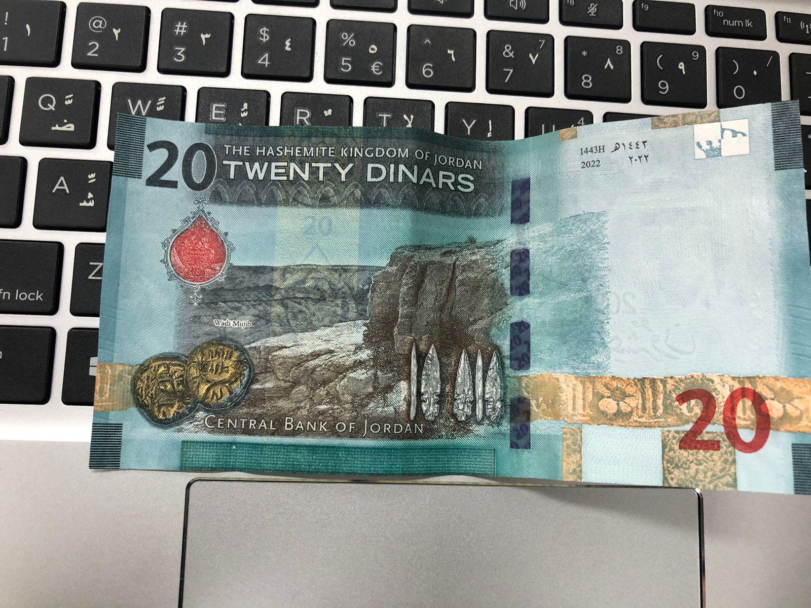
  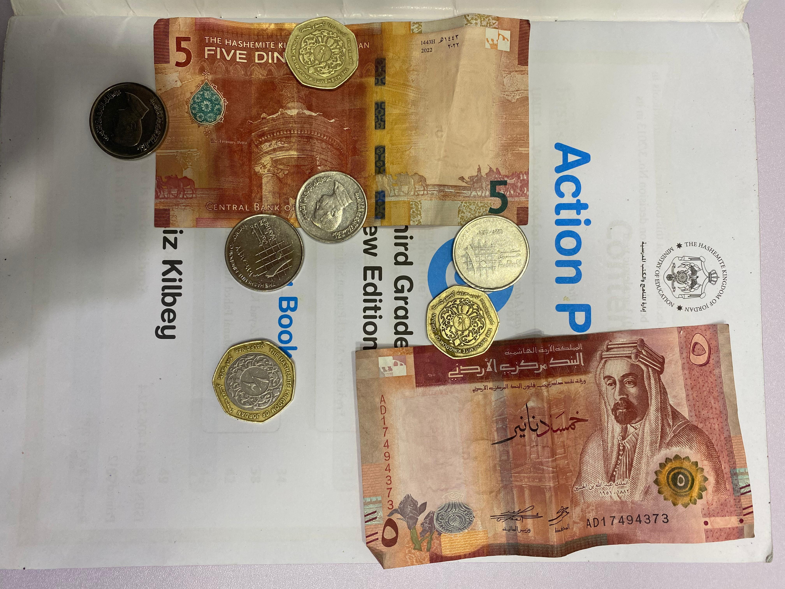

  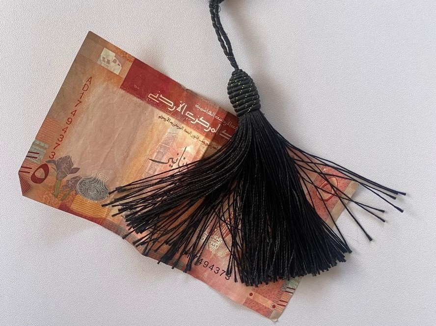
  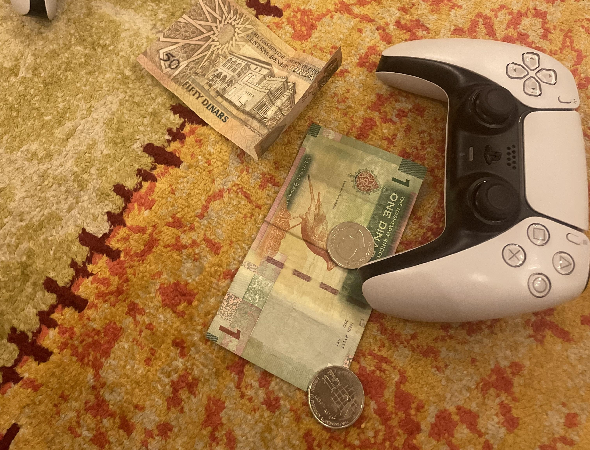

### Data Annotation:
Roboflow was used for annotation, making the dataset ready for training the YOLOv8 model.

Example Annotated Images:

  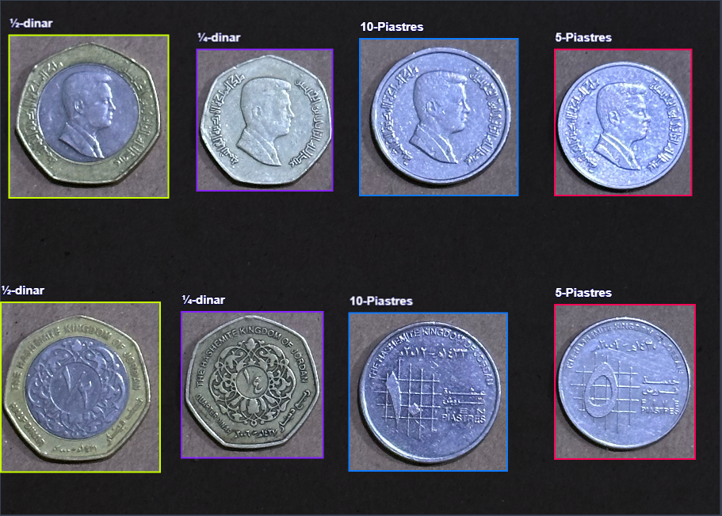
  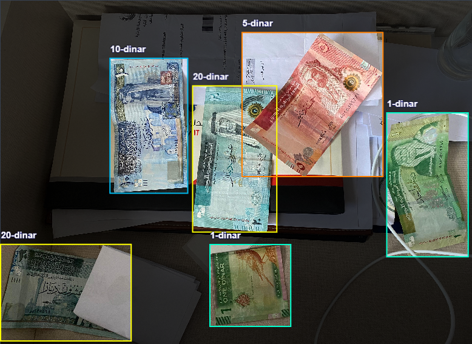

### Preprocessing :
Preprocessing ensures the dataset is in a standard format (e.g. all images are the same size). This step is essential to ensure the dataset is consistent before training a model.
Preprocessing applies to all images in the Train, Valid, and Test set (unlike Augmentations, which only apply to the Train set).

We used Auto-Orient and Resize to standardize dimensions.
Auto-Orient: Auto-orient strips your images of their EXIF data so that you see images displayed the same way they are stored on disk. 
Resize changes your image size and, optionally, scale to a desired set of dimensions. Annotations are adjusted proportionally (except in the case of “fill” below).

### Data Augmentation :

To enhance the diversity and robustness of our dataset, we applied the following augmentation techniques during the training process:

- **Flip:** Horizontal and Vertical
- **Crop:** Minimum Zoom of 0%, Maximum Zoom of 20%
- **Rotation:** Random rotation between -15° and +15°
- **Hue:** Random adjustment between -15° and +15°
- **Exposure:** Random adjustment between -10% and +10%

By utilizing these augmentation techniques, each training example was transformed into multiple variations, exposing the model to a broader range of scenarios. This contributed to improved performance and generalization during the object detection and counting tasks.

## Training
The YOLOv8 model was trained on the annotated dataset using the Roboflow platform. The training process involved optimizing the model to accurately detect and classify the various denominations of Jordanian coins.The model was trained with the following configuration:

- **Number of Epochs:** 200
- **Training Configuration:** Default configurations provided by Roboflow, including data augmentation 
techniques to improve generalization.

- **Training Graphs**:

  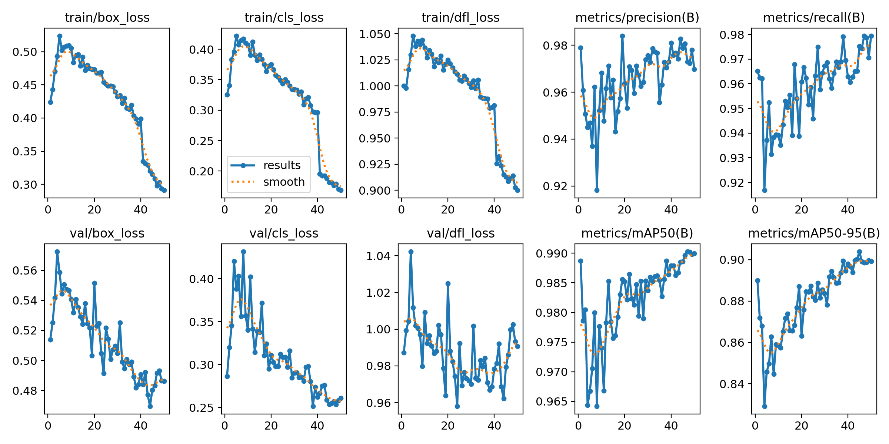
  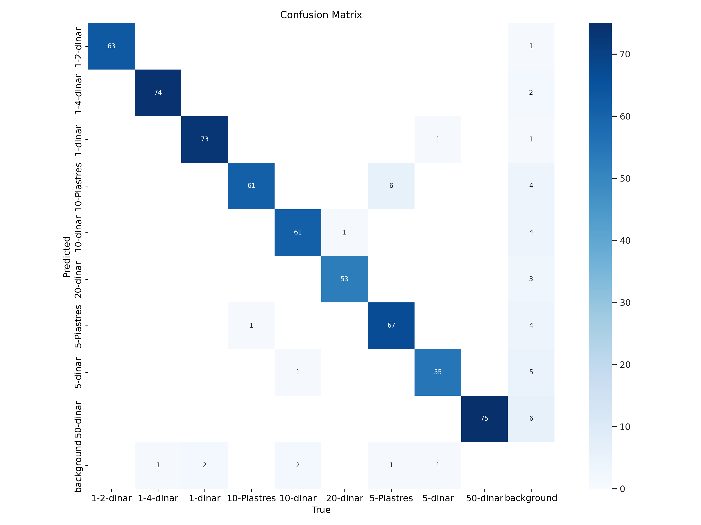

## Inference
Once trained, the model can be used to perform inference on new images containing Jordanian coins. Inference can be done either locally using the provided scripts or through Roboflow's inference API. The model outputs bounding boxes around detected coins along with their corresponding class labels and confidence scores.

### Inference with Roboflow Platform
Alternatively, you can perform inference using the Roboflow platform. The model outputs bounding boxes around detected coins along with their corresponding class labels and confidence scores.
To use the trained model for inference through Roboflow's inference API, please follow this <a href="https://app.roboflow.com/coinsvision/jordan-coins-detection-nqdbs/visualize/5">link</a>.
 

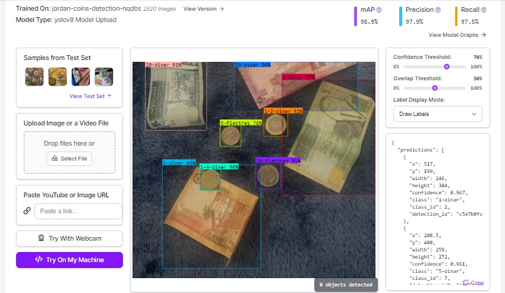

### Yolov8 Inference (Tracking & Counting)

To run inference with tracking & counting the coins, please follow this <a href="Inference/Inference (Tracking & Counting).ipynb">notebook</a>. 

- **Image Inference Examples**

  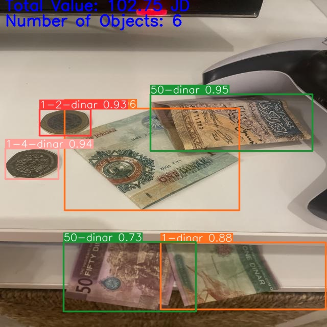
  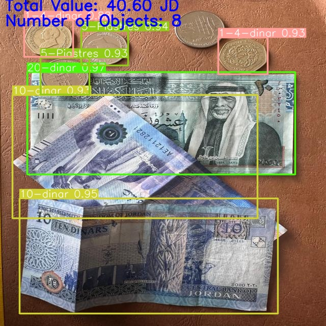

 

- **Video Inference Examples**
[Watch this video](Inference/results/Jordanian_dinar_coins_and_banknotes.mp4)

## Presentation
For more details, please refer to our presentation <a href="https://prezi.com/p/edit/twuqatenzpzm/">here</a>

## Acknowledgments
This code is based on the YOLOv8l implementation by Ultralytics.See their <a href="https://github.com/ultralytics/ultralytics">GitHub</a> Repository for more information.
