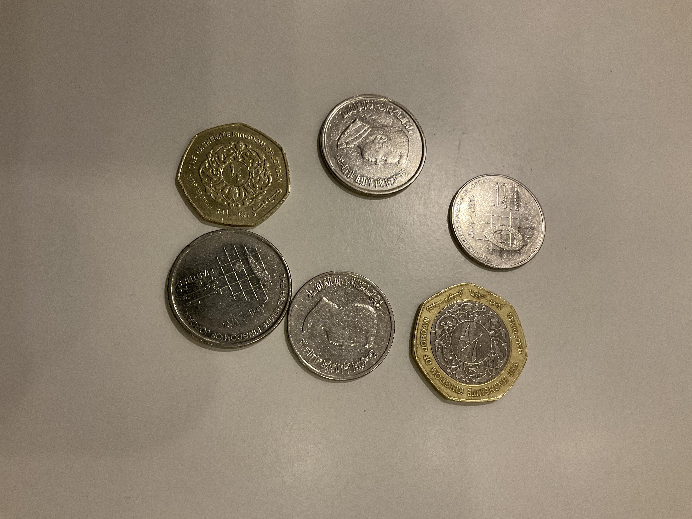

# Jordan Coins Detection (Tracking & Counting)

## Overview
Jordanian Coins Vision is a computer vision project focused on detecting and recognizing Jordanian coins using YOLOv8, powered by the Roboflow platform. The project aims to achieve accurate real-time object detection and counting of various denominations of Jordanian coins.

## Dataset:
The dataset for this project was created by capturing photos of Jordanian coins and then uploading them to the Roboflow platform.

### Data Collection:

The dataset consists of images with the following 9 classes:

- 5-Piastres
- 10-Piastres
- 1-4-dinar
- 1-2-dinar
- 1-dinar
- 5-dinars
- 10-dinar
- 20-dinar
- 50-dinar

  
  

  
  

### Data Annotation:
Roboflow was used for annotation, making the dataset ready for training the YOLOv8 model.

Example Annotated Images:

  
  

